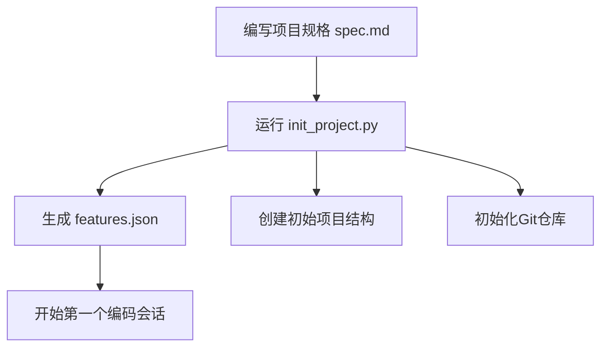
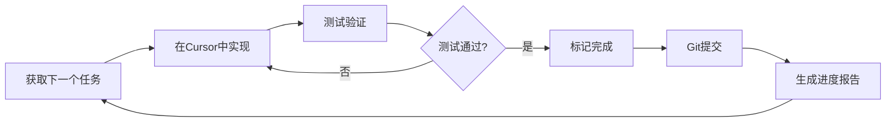

# Cursor 自主编码流程

一套优雅的长期自主编码框架，专为Cursor IDE设计。基于原始Claude Agent SDK流程改进，充分利用Cursor的原生能力。

**🎉 v1.1 新增**: 完整的Monorepo支持！适用于有100+组件的大型项目，每个组件可独立开发和维护。

**🚀 v1.2 新增**: 
- **全局规则系统** - 在根目录统一管理所有组件的规范和验证方法
- **全自动化模式** - 可选的自动循环开发模式，减少手动操作

**✨ v2.0 重大升级**:
- **统一CLI工具** `pep-dev` - 简洁强大的命令行界面
- **Spec-First工作流** - 从 spec.md 自动生成 features.json
- **任务归档系统** - 已完成任务自动归档，清晰的历史记录
- **自动合规检查** - 技术栈、架构、规范的自动验证
- **向后兼容** - 完全兼容 v1.x 的工作流

[📖 查看 V2.0 升级指南](./UPGRADE_V2.md)

## 核心特性

### 🎯 任务分解与追踪
- 自动将复杂项目分解为可管理的功能点
- JSON格式的功能清单作为唯一真实来源
- 实时进度追踪和状态管理

### 🔄 迭代式开发
- 每次会话专注1-3个功能的完整实现
- 自动生成详细的开发提示词
- 会话间通过Git和进度文件传递上下文

### ✅ 质量保证
- 集成测试用例定义
- 功能验证检查清单
- Git提交历史记录所有变更

### 📊 可视化进度
- 进度报告生成器
- 功能完成度统计
- 时间估算和追踪

---

## ⚡ 快速开始

### 安装 pep-dev 命令行工具

```bash
# 方式1: 创建软链接（推荐）
sudo ln -s /Users/mengxin/Documents/Code/公司项目/pep-components-svelte/.ai-workflow/pep-dev /usr/local/bin/pep-dev

# 方式2: 添加 alias
echo 'alias pep-dev="/path/to/pep-components-svelte/cursor-autonomous-coding/pep-dev"' >> ~/.zshrc
source ~/.zshrc

# 验证安装
pep-dev help
```

### 5分钟上手 - 单组件开发

```bash
# 1. 创建规格文档
vim components/pep-button/spec.md

# 2. 初始化并生成功能清单
pep-dev init pep-button
pep-dev spec pep-button    # 使用 Cursor AI 生成 features.json

# 3. 验证和检查
pep-dev validate pep-button
pep-dev check pep-button

# 4. 获取第一个任务
pep-dev next pep-button --save

# 5. 在 Cursor 中开发
# @current-task.md 查看任务，使用 Composer/Chat 开发

# 6. 完成并归档
pep-dev done pep-button 1 --tested

# 7. 继续下一个任务
pep-dev next pep-button --save
```

### 核心命令速查

```bash
pep-dev init <component>       # 初始化组件
pep-dev spec <component>       # 生成features.json
pep-dev next <component>       # 获取下一个任务
pep-dev done <component> <id>  # 完成任务并归档
pep-dev validate <component>   # 验证功能清单
pep-dev check <component>      # 合规性检查
pep-dev status <component>     # 查看进度
pep-dev summary                # 整体进度
```

---

## 📚 核心指南（必读）

### [01-快速配置](./docs/guides/01-快速配置.md) ⭐ 首次使用
5分钟完成配置，包括：
- ✅ 安装和验证
- ✅ Monorepo vs 标准项目选择
- ✅ 全局规则配置（Monorepo）
- ✅ 全自动化模式（可选）

### [02-单组件开发](./docs/guides/02-单组件开发.md) 🎯 Monorepo核心
Monorepo单组件完整开发流程：
- ✅ 初始化组件
- ✅ 编写功能清单
- ✅ 获取任务 → Cursor开发 → 标记完成
- ✅ 进度追踪和最佳实践

### [03-公共逻辑开发](./docs/guides/03-公共逻辑开发.md) 🔧 Monorepo进阶
开发Monorepo公共代码：
- ✅ 公共工具包（shared-utils）
- ✅ 公共样式包（shared-styles）
- ✅ 全局配置文件和规则
- ✅ 公共构建脚本

[查看完整文档索引 →](./docs/README.md)

---

## 快速开始

### 标准项目模式

```bash
cd /path/to/your/project
python3 cursor-autonomous-coding/scripts/init_project.py --spec spec.md
```

### Monorepo模式

```bash
cd /path/to/your/monorepo

# 初始化单个组件
python3 cursor-autonomous-coding/scripts/init_component.py \
  --component pep-common-banner

# 验证全局规则
python3 cursor-autonomous-coding/scripts/validate_global_rules.py \
  --component pep-common-banner

# 获取组件任务
python3 cursor-autonomous-coding/scripts/next_task.py \
  --component pep-common-banner \
  --save

# 可选：启动全自动化模式
python3 cursor-autonomous-coding/scripts/auto_develop.py \
  --component pep-common-banner

# 查看全局进度
python3 cursor-autonomous-coding/scripts/monorepo_summary.py
```

这将创建：
- `features.json` - 功能清单（100-200个功能点）
- `cursor-progress.md` - 进度追踪文档
- `.cursor-session/` - 会话配置目录

### 2. 开始编码会话

在Cursor中打开生成的提示词文件：

```bash
# 查看当前应该做什么
python3 cursor-autonomous-coding/scripts/next_task.py

# 这会输出下一个任务的详细提示词
# 复制提示词到Cursor的Composer中
```

### 3. 完成功能后

```bash
# 标记功能为已完成
python3 cursor-autonomous-coding/scripts/mark_done.py --feature-id 1

# 提交进度
git add .
git commit -m "feat: 完成功能 #1 - [功能描述]"

# 生成进度报告
python3 cursor-autonomous-coding/scripts/report.py
```

## 工作流程

### 初始化阶段



### 编码迭代阶段



## 项目结构

```
your-project/
├── features.json              # 功能清单（单一真实来源）
├── cursor-progress.md         # 进度追踪文档
├── .cursor-session/
│   ├── current-task.md       # 当前任务详情
│   ├── session-history.json  # 会话历史
│   └── config.json           # 配置文件
├── spec.md                   # 项目规格说明
└── [your application files]
```

## 功能清单格式

`features.json` 是整个流程的核心：

```json
[
  {
    "id": 1,
    "category": "core",
    "priority": "high",
    "title": "用户认证系统",
    "description": "实现基于JWT的用户登录和注册功能",
    "acceptance_criteria": [
      "用户可以通过邮箱和密码注册",
      "用户可以登录并获得JWT令牌",
      "令牌在请求头中正确验证",
      "密码使用bcrypt加密存储"
    ],
    "estimated_complexity": "medium",
    "dependencies": [],
    "status": "pending",
    "completed_at": null,
    "tested": false,
    "commit_hash": null
  }
]
```

### 状态说明
- `pending` - 待开发
- `in_progress` - 开发中
- `completed` - 已完成
- `tested` - 已测试验证
- `blocked` - 被阻塞

## 脚本工具

### 标准项目模式脚本

#### init_project.py
初始化项目结构和功能清单

```bash
python3 scripts/init_project.py --spec spec.md --features 150
```

参数：
- `--spec` - 项目规格文件路径
- `--features` - 生成的功能数量（默认150）
- `--project-dir` - 项目目录（默认当前目录）

### next_task.py
获取下一个应该完成的任务

```bash
python3 scripts/next_task.py --format markdown
```

参数：
- `--format` - 输出格式：markdown/json/text
- `--count` - 显示接下来N个任务（默认1）

### mark_done.py
标记功能为已完成

```bash
python3 scripts/mark_done.py --feature-id 1 --commit-hash abc123
```

参数：
- `--feature-id` - 功能ID
- `--commit-hash` - Git提交哈希（可选，自动获取）
- `--tested` - 标记为已测试

### report.py
生成进度报告

```bash
python3 scripts/report.py --output report.html
```

参数：
- `--output` - 输出文件路径
- `--format` - 格式：html/markdown/json

### validate.py
验证功能清单和项目状态

```bash
python3 scripts/validate.py
```

检查：
- features.json格式正确性
- Git提交与功能的对应关系
- 依赖关系的完整性
- 测试覆盖情况

### validate_global_rules.py ⭐ NEW
验证组件是否符合全局规范

```bash
python3 scripts/validate_global_rules.py --component pep-common-banner
```

检查：
- 组件命名规范
- 必需文件完整性
- 文档规范
- 代码质量标准
- Git规范
- 无障碍要求

### auto_develop.py ⭐ NEW
全自动化开发模式

```bash
python3 scripts/auto_develop.py --component pep-common-banner
```

功能：
- 自动获取下一个任务
- 生成Cursor提示词
- 等待开发完成
- 自动测试和提交（可选）
- 循环到下一个任务

## 提示词模板

### 初始化提示词模板

位于 `prompts/init_prompt.md`，用于第一次会话：

```markdown
# 项目初始化 - Session 1

## 目标
根据项目规格建立基础架构

## 任务清单
1. 阅读 spec.md 理解项目需求
2. 创建项目目录结构
3. 初始化依赖管理（package.json/requirements.txt等）
4. 设置开发环境配置
5. 创建README.md
6. 初始化Git仓库并首次提交

## 技术栈
[从spec.md中提取]

## 注意事项
- 确保所有配置文件都已创建
- 验证依赖安装成功
- 文档清晰完整
```

### 功能开发提示词模板

位于 `prompts/feature_prompt.md`，用于每个功能开发：

```markdown
# 功能开发 - [功能标题]

## 当前进度
- 总功能数: {total}
- 已完成: {completed} ({percentage}%)
- 当前功能: #{feature_id}

## 功能详情
**标题**: {title}
**类别**: {category}
**优先级**: {priority}

**描述**: {description}

**验收标准**:
{acceptance_criteria}

**依赖**:
{dependencies}

## 开发步骤
1. 实现核心功能代码
2. 编写必要的测试
3. 更新相关文档
4. 本地测试验证
5. 确保通过所有验收标准

## 验证检查清单
- [ ] 所有验收标准都已满足
- [ ] 代码符合项目规范
- [ ] 没有引入新的linter错误
- [ ] 相关文档已更新
- [ ] 功能已手动测试
- [ ] Git提交信息清晰

## 完成后
运行以下命令标记完成：
```bash
python3 cursor-autonomous-coding/scripts/mark_done.py --feature-id {feature_id}
```
```

## Cursor集成最佳实践

### 1. 使用Composer模式
将生成的提示词直接粘贴到Cursor Composer中，利用其上下文理解能力。

### 2. 设置工作空间规则
在 `.cursorrules` 文件中添加：

```
# 自主编码流程规则

当进行功能开发时：
1. 首先查看 .cursor-session/current-task.md 了解当前任务
2. 严格遵循验收标准
3. 完成后使用提供的命令标记进度
4. 每个功能独立提交Git
5. 保持代码质量和文档同步更新
```

### 3. 利用Cursor的工具
- **Cmd/Ctrl + K**: 快速代码生成
- **Cmd/Ctrl + L**: 打开Chat询问实现细节
- **Composer**: 处理复杂的多文件修改

### 4. 会话管理
- 每个功能开发在一个独立的Composer会话中
- 复杂功能可以分解为多个子任务
- 使用 `next_task.py` 获取下一个任务

## 与原始Claude版本的区别

| 特性 | Claude SDK版本 | Cursor版本 |
|------|---------------|-----------|
| **AI引擎** | Claude API + SDK | Cursor内置AI |
| **工具执行** | SDK工具（Read/Write/Bash等） | Cursor编辑器原生能力 |
| **浏览器测试** | Puppeteer MCP | 手动测试 + 可选Playwright |
| **会话管理** | 自动迭代 | 手动触发，更可控 |
| **安全控制** | 沙箱 + 命令白名单 | 依赖用户审查 |
| **成本** | API调用费用 | Cursor订阅费用 |
| **灵活性** | 自动化程度高 | 开发者控制更强 |

## 高级用法

### 批量处理功能
```bash
# 获取所有高优先级待完成功能
python3 scripts/next_task.py --priority high --count 10

# 批量生成提示词
python3 scripts/batch_prompts.py --category core
```

### 功能依赖管理
```bash
# 显示依赖树
python3 scripts/dependencies.py --visualize

# 检查可并行开发的功能
python3 scripts/dependencies.py --parallel
```

### 自定义验证规则
编辑 `config/validation_rules.json`：

```json
{
  "code_quality": {
    "max_function_length": 50,
    "require_docstrings": true,
    "require_type_hints": true
  },
  "testing": {
    "min_coverage": 80,
    "require_unit_tests": true
  },
  "documentation": {
    "require_readme_update": true,
    "require_changelog_entry": true
  }
}
```

## 故障排除

### features.json格式错误
```bash
python3 scripts/validate.py --fix
```

### Git历史不一致
```bash
python3 scripts/sync_git.py
```

### 进度丢失
所有进度存储在 `features.json` 中，定期备份：
```bash
cp features.json features.backup.json
```

## 示例工作流

完整的开发流程示例：

```bash
# 1. 初始化项目
cd my-new-project
python3 /path/to/cursor-autonomous-coding/scripts/init_project.py \
  --spec project-spec.md \
  --features 120

# 2. 查看第一个任务
python3 /path/to/cursor-autonomous-coding/scripts/next_task.py

# 输出：
# ╔══════════════════════════════════════════════════════════╗
# ║ Next Task: Feature #1                                    ║
# ╠══════════════════════════════════════════════════════════╣
# ║ Title: 设置项目基础架构                                    ║
# ║ Priority: high | Category: infrastructure                 ║
# ╚══════════════════════════════════════════════════════════╝
# 
# [详细的提示词内容...]

# 3. 复制提示词到Cursor Composer，完成开发

# 4. 标记完成
python3 /path/to/cursor-autonomous-coding/scripts/mark_done.py --feature-id 1

# 5. 提交代码
git add .
git commit -m "feat: 完成项目基础架构设置"

# 6. 查看进度
python3 /path/to/cursor-autonomous-coding/scripts/report.py

# 7. 继续下一个任务
python3 /path/to/cursor-autonomous-coding/scripts/next_task.py
```

## 贡献指南

欢迎改进此工具！可以扩展的方向：
- 更多输出格式支持
- 与CI/CD集成
- 自动化测试框架集成
- 团队协作功能
- 时间追踪和估算改进

## 许可证

MIT License

## 致谢

基于Anthropic的Claude Agent SDK自主编码框架改进。

