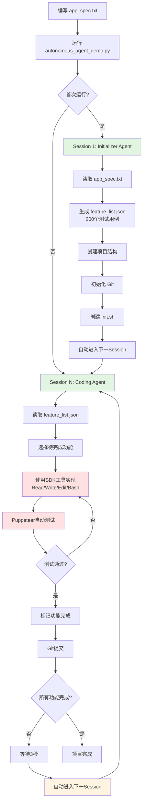
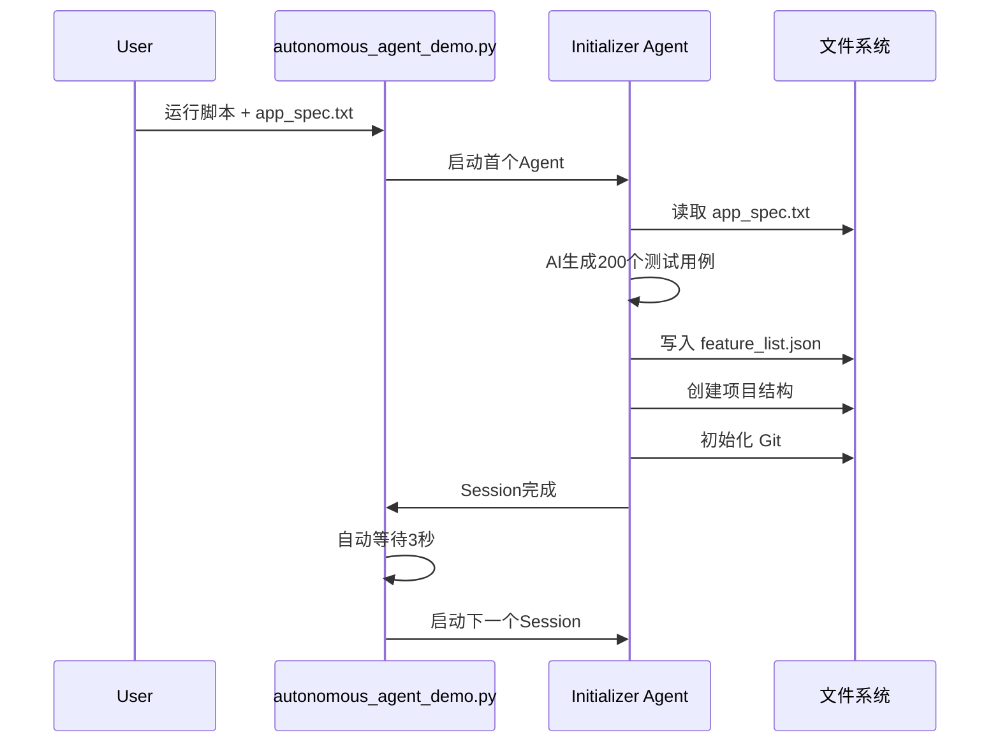
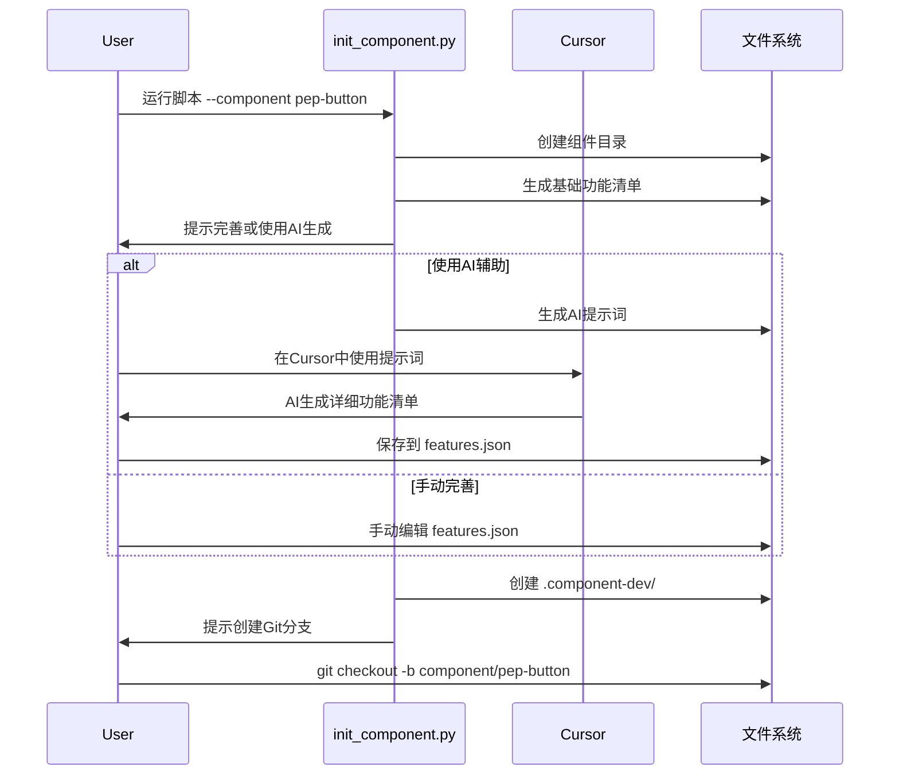
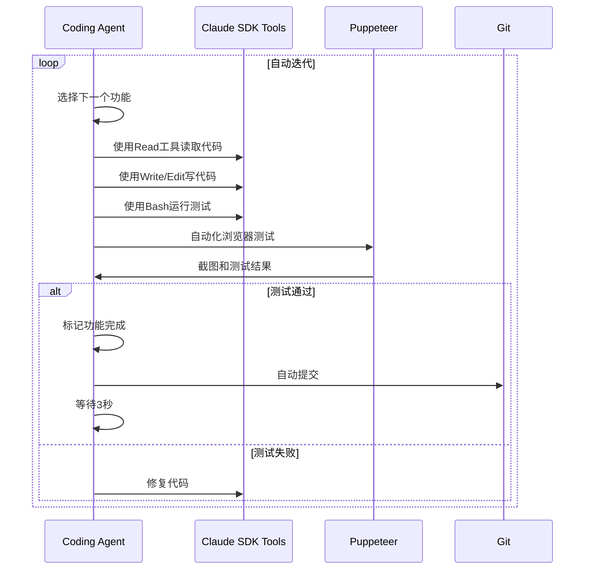
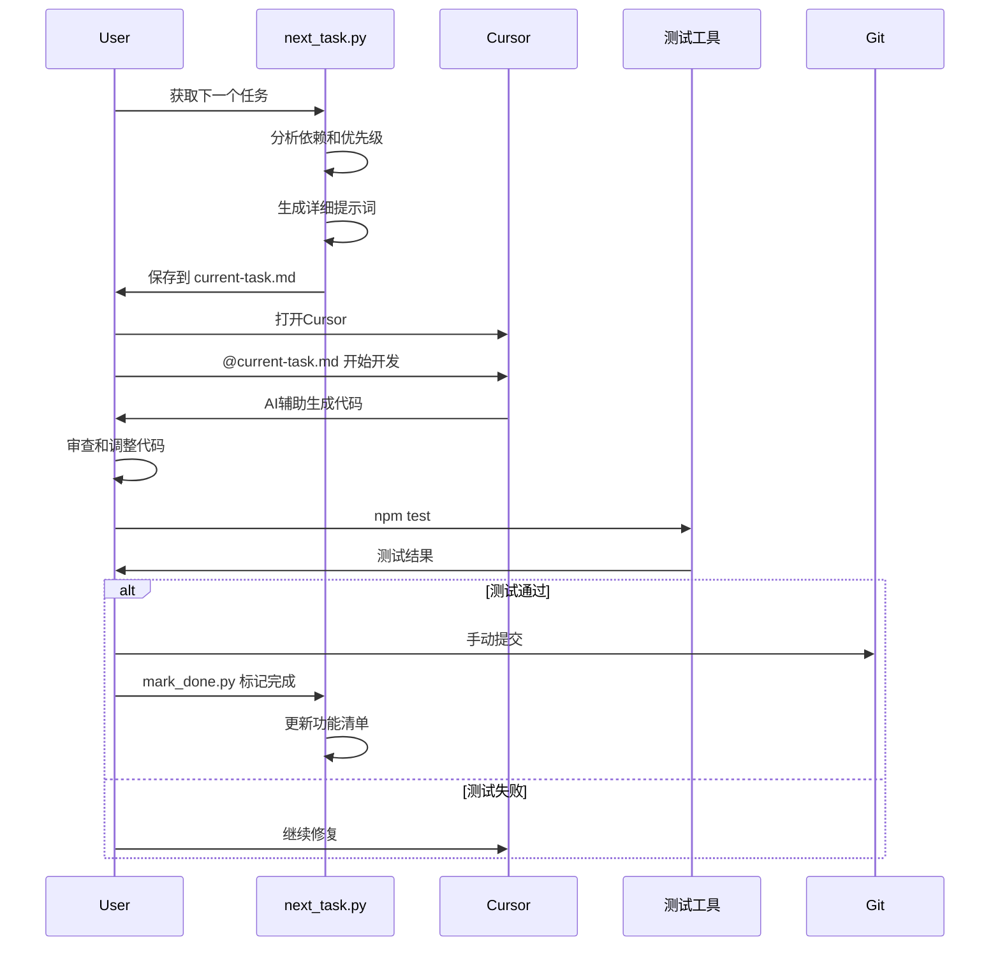
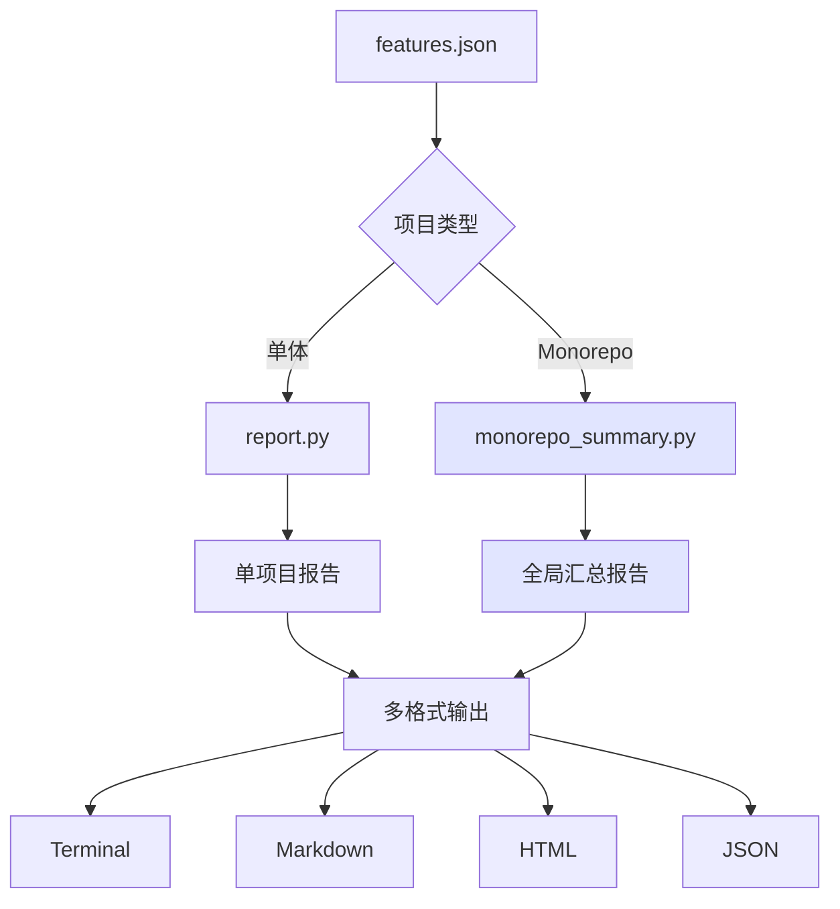
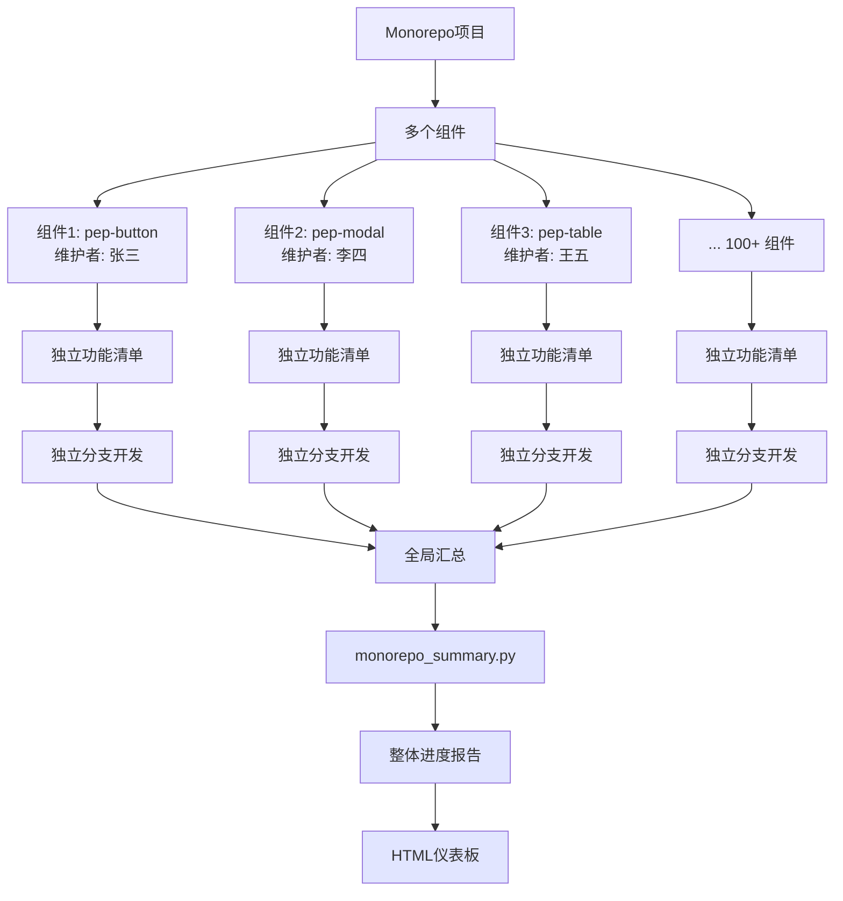

# 工作流程对比：Cursor版本 vs Claude SDK版本

## 🎯 总览对比

| 维度 | Claude SDK版本 | Cursor Monorepo版本 |
|------|---------------|-------------------|
| **执行方式** | 完全自动化 | 半自动，人工主导 |
| **AI引擎** | Claude API | Cursor内置AI |
| **迭代模式** | 自动无限循环 | 手动触发每个步骤 |
| **适用场景** | 单体项目 | Monorepo + 单体项目 |
| **组件管理** | 不支持 | ✅ 完整支持 |
| **浏览器测试** | Puppeteer自动化 | 手动测试 |
| **成本** | API调用费用 | Cursor订阅 |

---

## 📊 完整流程对比图

### Claude SDK版本流程



### Cursor Monorepo版本流程

```mermaid
graph TD
    A[编写项目规格 spec.md<br/>或组件规格] --> B{项目类型?}
    
    B -->|单体项目| C1[运行 init_project.py]
    C1 --> D1[生成 features.json]
    D1 --> E1[创建 .cursor-session/]
    
    B -->|Monorepo组件| C2[运行 init_component.py<br/>--component pep-button]
    C2 --> D2[在 components/pep-button/<br/>生成 features.json]
    D2 --> E2[创建 .component-dev/]
    
    E1 --> F[可选: Git分支创建]
    E2 --> F
    
    F --> G[运行 next_task.py<br/>获取任务]
    G --> H[生成详细提示词<br/>保存到 current-task.md]
    H --> I[在Cursor中打开项目]
    
    I --> J{开发方式?}
    J -->|Composer| K1[@current-task.md<br/>AI生成代码]
    J -->|Chat| K2[询问具体实现]
    J -->|手动| K3[直接编码]
    
    K1 --> L[审查并调整代码]
    K2 --> L
    K3 --> L
    
    L --> M[手动测试<br/>npm test / 浏览器]
    M --> N{测试通过?}
    
    N -->|否| J
    N -->|是| O[Git提交]
    O --> P[运行 mark_done.py<br/>标记功能完成]
    
    P --> Q[更新 features.json]
    Q --> R[更新 DEVELOPMENT.md]
    R --> S[更新 session-history]
    
    S --> T{Monorepo?}
    T -->|是| U1[运行 monorepo_summary.py<br/>查看全局进度]
    T -->|否| U2[运行 report.py<br/>查看项目进度]
    
    U1 --> V{所有功能完成?}
    U2 --> V
    
    V -->|否| W[手动运行 next_task.py]
    W --> G
    
    V -->|是| X[组件/项目完成]
    
    style C2 fill:#e1f5e1
    style D2 fill:#e1f5e1
    style J fill:#ffe1e1
    style M fill:#ffe1e1
    style W fill:#fff4e1
    style U1 fill:#e1e5ff
```

---

## 🔄 阶段对比

### Phase 1: 初始化

#### Claude SDK版本


**特点**:
- ✅ 完全自动化
- ✅ 一次性生成所有功能
- ❌ 用户无法介入
- ❌ 功能定义不够灵活

#### Cursor Monorepo版本


**特点**:
- ✅ 用户完全控制
- ✅ 可以灵活调整
- ✅ 支持Monorepo
- ⚠️ 需要手动操作

---

### Phase 2: 开发迭代

#### Claude SDK版本


**特点**:
- ✅ 完全自动化
- ✅ 包含浏览器测试
- ❌ 可能失控
- ❌ 调试困难
- ❌ 成本较高（API调用）

#### Cursor Monorepo版本


**特点**:
- ✅ 人工审查每一步
- ✅ 质量可控
- ✅ 灵活调整
- ✅ 成本固定（Cursor订阅）
- ⚠️ 需要手动操作

---

### Phase 3: 进度追踪

#### Claude SDK版本


**特点**:
- ✅ 自动更新
- ❌ 无可视化报告
- ❌ 难以全局把控

#### Cursor Monorepo版本


**特点**:
- ✅ 多格式报告
- ✅ 可视化仪表板
- ✅ Monorepo全局视图
- ✅ 易于分享

---

## 📋 详细步骤对比

### 步骤1: 需求输入

| 步骤 | Claude SDK | Cursor Monorepo | 相同/不同 |
|------|-----------|----------------|---------|
| **输入格式** | app_spec.txt | spec.md 或 SPEC.md | ✅ 相同（文本规格） |
| **规格内容** | 完整应用规格 | 完整应用 或 单组件规格 | ⚠️ 不同（支持组件级别） |
| **位置** | 项目根目录 | 项目根目录 或 组件目录 | ⚠️ 不同 |

### 步骤2: 初始化

| 步骤 | Claude SDK | Cursor Monorepo | 相同/不同 |
|------|-----------|----------------|---------|
| **脚本** | autonomous_agent_demo.py | init_project.py 或 init_component.py | ⚠️ 不同 |
| **功能清单** | feature_list.json (200+) | features.json (自定义数量) | ✅ 相似（格式相同） |
| **自动化程度** | 完全自动生成 | 模板 + AI辅助或手动 | ❌ 不同 |
| **Git初始化** | 自动 | 自动 + 分支提示 | ⚠️ 部分相同 |
| **Monorepo支持** | ❌ 不支持 | ✅ 完整支持 | ❌ 不同 |

### 步骤3: 获取任务

| 步骤 | Claude SDK | Cursor Monorepo | 相同/不同 |
|------|-----------|----------------|---------|
| **方式** | 自动选择 | 手动运行 next_task.py | ❌ 不同 |
| **依赖分析** | ✅ 自动 | ✅ 自动 | ✅ 相同 |
| **优先级排序** | ✅ 自动 | ✅ 自动 | ✅ 相同 |
| **任务提示** | 内置prompt | 详细markdown提示词 | ⚠️ 部分相同 |
| **保存位置** | 内存中 | current-task.md 文件 | ❌ 不同 |

### 步骤4: 代码实现

| 步骤 | Claude SDK | Cursor Monorepo | 相同/不同 |
|------|-----------|----------------|---------|
| **AI引擎** | Claude API | Cursor内置AI | ❌ 不同 |
| **工具** | SDK工具（Read/Write/Edit/Bash） | Cursor编辑器 | ❌ 不同 |
| **自动化** | 完全自动 | AI辅助 + 人工 | ❌ 不同 |
| **代码审查** | 无（自动执行） | 人工审查 | ❌ 不同 |
| **灵活性** | 低 | 高 | ❌ 不同 |

### 步骤5: 测试验证

| 步骤 | Claude SDK | Cursor Monorepo | 相同/不同 |
|------|-----------|----------------|---------|
| **浏览器测试** | Puppeteer自动化 | 手动测试 | ❌ 不同 |
| **截图验证** | 自动截图 | 手动截图（可选） | ❌ 不同 |
| **测试失败** | 自动重试 | 手动修复 | ❌ 不同 |
| **验收标准** | ✅ 自动检查 | ✅ 手动验证 | ⚠️ 部分相同 |

### 步骤6: 标记完成

| 步骤 | Claude SDK | Cursor Monorepo | 相同/不同 |
|------|-----------|----------------|---------|
| **方式** | 自动标记 | 运行 mark_done.py | ❌ 不同 |
| **更新内容** | feature_list.json | features.json + DEVELOPMENT.md | ⚠️ 部分相同 |
| **Git提交** | 自动提交 | 手动提交 | ❌ 不同 |
| **记录历史** | claude-progress.txt | session-history.json | ✅ 相似 |

### 步骤7: 进度查看

| 步骤 | Claude SDK | Cursor Monorepo | 相同/不同 |
|------|-----------|----------------|---------|
| **查看方式** | 自动输出 | 运行 report.py / monorepo_summary.py | ❌ 不同 |
| **报告格式** | 终端文本 | Terminal/Markdown/HTML/JSON | ⚠️ 不同（更丰富） |
| **Monorepo汇总** | ❌ 不支持 | ✅ 完整支持 | ❌ 不同 |
| **可视化** | ❌ 无 | ✅ HTML仪表板 | ❌ 不同 |

### 步骤8: 迭代循环

| 步骤 | Claude SDK | Cursor Monorepo | 相同/不同 |
|------|-----------|----------------|---------|
| **触发方式** | 自动（3秒后） | 手动运行命令 | ❌ 不同 |
| **停止方式** | Ctrl+C 或 max-iterations | 完成所有功能 | ⚠️ 部分相同 |
| **暂停恢复** | 重新运行脚本 | 随时运行下一个命令 | ⚠️ 部分相同 |

---

## 🎯 核心差异总结

### Claude SDK版本优势
1. ✅ **完全自动化** - 无需人工干预
2. ✅ **包含浏览器测试** - Puppeteer自动化
3. ✅ **持续运行** - 自动迭代直到完成
4. ✅ **适合长时间运行** - 可以无人值守

### Cursor Monorepo版本优势
1. ✅ **完全可控** - 每一步都可审查
2. ✅ **Monorepo支持** - 100+组件独立管理
3. ✅ **灵活调整** - 随时修改和优化
4. ✅ **成本固定** - 不增加API费用
5. ✅ **多人协作** - 支持独立分支
6. ✅ **丰富报告** - 多格式可视化

### 相同的核心逻辑
1. ✅ **功能清单作为单一真实来源**
2. ✅ **依赖关系分析和排序**
3. ✅ **优先级管理**
4. ✅ **Git版本控制**
5. ✅ **进度追踪和历史记录**

---

## 🔄 Monorepo特有流程



**这是Claude SDK版本无法实现的！**

---

## 💡 使用建议

### 选择Claude SDK版本，如果：
- ✅ 需要完全自动化
- ✅ 单体项目
- ✅ 可以无人值守运行
- ✅ 预算充足

### 选择Cursor Monorepo版本，如果：
- ✅ 需要完全控制每一步
- ✅ Monorepo项目（特别是100+组件）
- ✅ 多人协作开发
- ✅ 希望控制成本
- ✅ 需要灵活调整

---

## 🎉 总结

Cursor Monorepo版本保留了Claude SDK版本的**核心优势**（功能清单管理、依赖分析、优先级排序），同时增加了：

1. **Monorepo完整支持** - 这是最大的差异和优势
2. **人工可控性** - 每一步都可审查和调整
3. **成本优化** - 不增加API费用
4. **团队协作** - 支持多人并行开发
5. **丰富报告** - HTML仪表板和全局汇总

对于您的 `pep-components-svelte` 项目（100+组件，多人维护），**Cursor Monorepo版本是最佳选择**！

