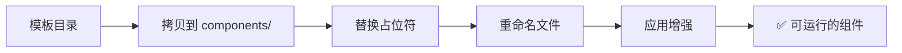

# 模板说明

这个目录包含所有用于生成新组件和文件的模板。

## 📁 目录结构

```
templates/
├── component/          # 组件模板（核心）
├── spec/              # spec.md 模板
└── feature/           # features.json 示例
```

---

## 📦 component/ - 组件模板

**这是核心模板**，用于创建新的 PEP 组件。

### 设计理念

使用**"拷贝+替换"**而非"代码生成"：

✅ **优势**：
- **保证能运行**：模板本身就是可运行的组件
- **配置完整**：所有必需文件都包含
- **依赖一致**：与现有组件保持一致
- **易于维护**：更新模板即可，无需修改生成逻辑

❌ **避免的问题**：
- 代码生成可能有语法错误
- 配置文件可能不完整
- 依赖版本可能不对
- 生成的组件可能无法立即运行

### 占位符规则

模板使用以下占位符，脚本会自动替换：

| 占位符 | 说明 | 示例 |
|--------|------|------|
| `{{COMPONENT_NAME}}` | 组件名称（kebab-case）| `pep-my-component` |
| `{{COMPONENT_NAME_PASCAL}}` | 组件名称（PascalCase）| `PepMyComponent` |
| `{{DESCRIPTION}}` | 组件描述 | "我的组件" |
| `{{INIT_DATE}}` | 初始化时间 | `2025-12-18T10:30:00Z` |

### 文件列表

```
component/
├── package.json                    # 包配置（带占位符）
├── tsconfig.json                   # TypeScript 配置
├── vite.config.ts                  # Vite 配置
├── svelte.config.js                # Svelte 配置
├── README.md                       # 组件说明模板
├── spec.md                         # 规格说明模板（空）
├── features.json                   # 任务列表（空数组）
├── DEVELOPMENT.md                  # 开发日志模板
├── src/
│   ├── {{COMPONENT_NAME}}.svelte  # 主组件文件
│   ├── index.ts                   # 导出文件
│   ├── types.ts                   # 类型定义
│   ├── app.html                   # HTML 模板
│   └── routes/                    # SvelteKit 路由
│       ├── +layout.svelte
│       └── +page.svelte           # 预览页面
└── .component-dev/
    └── session_state.json         # 会话状态
```

### 使用方式

**自动使用**（通过 `/pep-start` 命令）：

```bash
# 在 Cursor 中运行
/pep-start pep-my-component

# AI 会调用脚本，脚本会：
# 1. 拷贝整个 component/ 目录
# 2. 替换所有占位符
# 3. 重命名包含占位符的文件
# 4. 根据模式进行增强（可选）
```

**手动使用**（调试）：

```bash
# 直接调用脚本
python3 scripts/scaffold_component.py \
  --component pep-my-component \
  --mode minimal \
  --template-data '{
    "description": "我的组件",
    "features": []
  }'
```

### 生成流程



---

## 📄 spec/ - spec.md 模板

包含不同类型组件的 spec.md 模板：

- `default.md` - 通用模板
- `display-component.md` - 展示组件模板（Banner、Card）
- `interactive-component.md` - 交互组件模板（Button、Input）

---

## 📋 feature/ - features.json 示例

提供标准的 features.json 示例，供参考。

---

## 🔧 维护模板

### 更新模板

如果需要更新所有新组件的默认结构：

1. 修改 `component/` 中的文件
2. 测试模板是否可运行
3. 新组件会自动使用最新模板

### 添加新模板

如果需要添加新类型的模板：

1. 在 `templates/` 下创建新目录
2. 更新相应的脚本以支持新模板
3. 更新本文档

---

## 💡 最佳实践

### 1. 保持模板简单

✅ 最小可运行的组件
❌ 不要包含过多默认功能

**理由**：简单的模板更稳定，开发者可以根据需要逐步增强。

### 2. 保证模板可运行

✅ 模板本身可以 `pnpm dev` 运行
❌ 不要包含语法错误

**测试方法**：
```bash
# 手动拷贝模板，测试是否可运行
cp -r .ai-workflow/templates/component /tmp/test-component
cd /tmp/test-component
pnpm install
pnpm dev
```

### 3. 使用清晰的占位符

✅ `{{COMPONENT_NAME}}` - 清晰明确
❌ `__NAME__` 或 `$NAME` - 可能与代码混淆

### 4. 保持与现有组件一致

模板应该与项目中现有组件的结构保持一致：
- 相同的依赖版本
- 相同的配置文件
- 相同的目录结构

**参考**：可以查看 `components/pep-notice/` 作为参考。

---

## 📚 相关文档

- [AI-First 开发流程](../AI-FIRST-WORKFLOW.md)
- [组件开发指南](../docs/guides/02-单组件开发.md)
- [快速配置](../docs/guides/01-快速配置.md)

