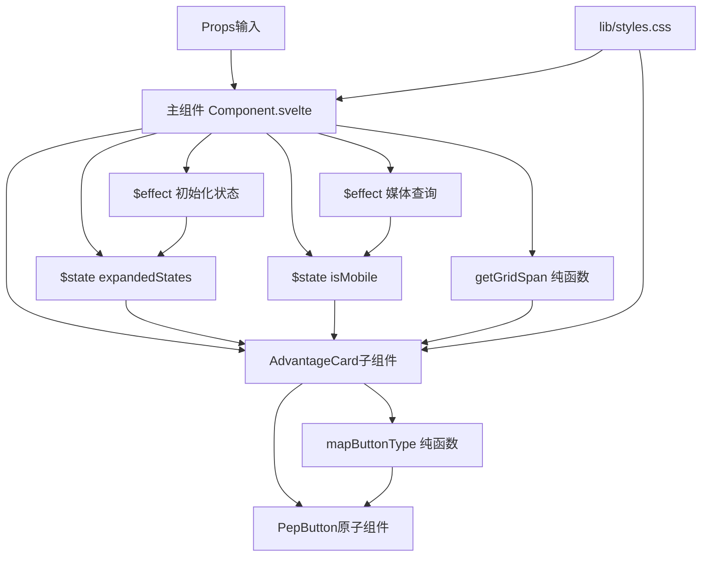

# pep-product-advantage-v2 组件架构说明

## 📋 概述

本文档基于**整洁架构（Clean Architecture）**原则，结合**Svelte最佳实践**，对 `pep-product-advantage-v2` 组件进行架构重构设计。重构目标是将当前单文件（340行）拆分为清晰的分层结构，实现**高内聚、低耦合**的代码组织。

**重要说明**：本架构遵循Svelte的哲学，不使用Vue的Composables模式，而是采用Svelte原生的响应式语句和纯函数组织代码。

---

## 🔍 当前问题分析

### 现状
- **单文件结构**：所有代码集中在 `pep-product-advantage-v2.svelte`（340行）
- **职责混乱**：UI渲染、业务逻辑、状态管理、样式定义混在一起
- **配置硬编码**：映射配置（`btnTypeMap`、`gridConfig`）直接写在组件中
- **逻辑耦合**：响应式逻辑、状态管理与UI渲染强耦合
- **样式集中**：所有CSS样式在 `<style>` 标签中，未分离

### 影响
- ❌ **可维护性差**：修改逻辑需要定位到具体行数
- ❌ **可测试性差**：业务逻辑无法独立测试
- ❌ **可复用性差**：配置和工具函数无法在其他组件复用
- ❌ **可读性差**：代码结构不清晰，难以快速理解

---

## 🏗️ 目标架构设计（Svelte风格）

### 架构分层（符合Svelte最佳实践）

```
┌─────────────────────────────────────────────────────────┐
│                    组件层 (Components)                   │
│  ┌─────────────────┐  ┌─────────────────┐              │
│  │ 主组件          │  │ 子组件          │              │
│  │ Component.svelte│  │ AdvantageCard  │              │
│  │ (响应式逻辑)    │  │ .svelte        │              │
│  └─────────────────┘  └─────────────────┘              │
└─────────────────────────────────────────────────────────┘
                          ↓ 依赖
┌─────────────────────────────────────────────────────────┐
│                    工具函数层 (Utils)                    │
│  ┌─────────────────┐  ┌─────────────────┐              │
│  │ lib/config.ts   │  │ lib/mappings.ts│              │
│  │ (纯函数)        │  │ (纯函数)       │              │
│  └─────────────────┘  └─────────────────┘              │
└─────────────────────────────────────────────────────────┘
                          ↓ 依赖
┌─────────────────────────────────────────────────────────┐
│                    数据层 (Data)                         │
│  ┌─────────────────┐                                     │
│  │ types.ts        │  (已存在)                          │
│  └─────────────────┘                                     │
└─────────────────────────────────────────────────────────┘
                          ↓ 依赖
┌─────────────────────────────────────────────────────────┐
│                    样式层 (Style)                        │
│  ┌─────────────────┐  ┌─────────────────┐              │
│  │ lib/styles.css  │  │ UnoCSS Classes │              │
│  │ (复杂样式)      │  │ (原子类)        │              │
│  └─────────────────┘  └─────────────────┘              │
└─────────────────────────────────────────────────────────┘
```

**关键区别**：
- ✅ **不使用Composables**：Svelte不需要Vue的Composables模式
- ✅ **响应式逻辑在组件中**：使用`$state`、`$derived`、`$effect`直接在组件中管理状态
- ✅ **纯函数工具**：工具函数是纯函数，不包含响应式逻辑
- ✅ **符合Svelte哲学**：利用Svelte的编译时优化，而不是运行时的组合式API

---

## 📁 目录结构设计（Svelte风格）

```
components/pep-product-advantage-v3/
├── src/
│   ├── pep-product-advantage-v2.svelte    # 🎨 主组件（包含响应式逻辑）
│   ├── lib/                                # 📚 组件库目录（SvelteKit约定）
│   │   ├── AdvantageCard.svelte           # 🎨 卡片子组件
│   │   ├── config.ts                       # ⚙️ 配置映射（纯函数）
│   │   ├── mappings.ts                    # 🔄 类型映射（纯函数）
│   │   └── styles.css                     # 🎨 组件样式（复杂样式）
│   ├── types.ts                           # 📘 类型定义（已存在）
│   └── index.ts                           # 📦 导出文件（已存在）
```

**说明**：
- `lib/`目录是SvelteKit的约定，用于存放组件内部使用的模块
- 子组件、工具函数、样式都放在`lib/`目录下
- 主组件使用Svelte原生的响应式语句管理状态

---

## 🔄 Svelte vs Vue 架构对比

### ❌ Vue风格（不推荐用于Svelte）

```typescript
// composables/useExpandedState.ts
export function useExpandedState(cardItemLists: CardRow[]) {
  let expandedStates = $state<boolean[][]>([]);
  // ... 响应式逻辑
  return { expandedStates, toggleExpand };
}

// 主组件
const { expandedStates, toggleExpand } = useExpandedState(cardItemLists);
```

**问题**：
- ❌ 这是Vue的Composition API模式
- ❌ Svelte不需要这种抽象层
- ❌ 增加了不必要的复杂性
- ❌ 失去了Svelte编译时优化的优势

### ✅ Svelte风格（推荐）

```svelte
<!-- 主组件 -->
<script lang="ts">
  let expandedStates = $state<boolean[][]>([]);
  
  $effect.pre(() => {
    // 响应式逻辑直接在组件中
    expandedStates = cardItemLists.map(...);
  });
  
  function toggleExpand(rIndex: number, cIndex: number) {
    // 函数直接在组件中
  }
</script>
```

**优势**：
- ✅ 符合Svelte哲学：响应式逻辑在组件中
- ✅ 利用编译时优化：Svelte会在编译时优化响应式代码
- ✅ 代码更直观：逻辑和UI在同一个文件中
- ✅ 减少抽象层：不需要额外的Composables层

---

## 📝 各层详细说明

### 1. 组件层 (Components Layer)

#### 1.1 主组件：`pep-product-advantage-v2.svelte`

**职责**：
- 组合子组件和共享UI组件（`PepFloorContainer`、`PepTitle`）
- 使用Svelte响应式语句管理状态（`$state`、`$derived`、`$effect`）
- 处理Props接收和传递
- 使用UnoCSS原子类进行布局

**代码结构**：
```svelte
<script lang="ts">
  import type { PepProductAdvantageV2Props } from './types';
  import { getGridSpan } from './lib/config';
  import { mapButtonType } from './lib/mappings';
  import AdvantageCard from './lib/AdvantageCard.svelte';
  import PepFloorContainer from '../../../shared/ui/src/PepFloorContainer.svelte';
  import PepTitle from '../../../shared/ui/src/PepTitle.svelte';
  import './lib/styles.css';

  let {
    baseInfo,
    cardItemLists = [],
    className = ''
  }: PepProductAdvantageV2Props = $props();

  // 响应式状态管理（Svelte原生方式）
  let expandedStates = $state<boolean[][]>([]);
  let isMobile = $state(false);

  // 计算属性
  const containerTheme = $derived(baseInfo?.theme === 'light' ? 'white' : 'grey');

  // 响应式效果：初始化折叠状态
  $effect.pre(() => {
    expandedStates = cardItemLists.map((row, rIndex) => 
      row.cardItem.map((_, cIndex) => {
        return expandedStates[rIndex]?.[cIndex] ?? (rIndex === 0 && cIndex === 0);
      })
    );
  });

  // 响应式效果：监听媒体查询
  $effect(() => {
    if (typeof window === 'undefined') return;
    
    const media = window.matchMedia('(max-width: 768px)');
    isMobile = media.matches;
    
    const handler = (e: MediaQueryListEvent) => {
      isMobile = e.matches;
    };
    
    media.addEventListener('change', handler);
    return () => media.removeEventListener('change', handler);
  });

  // 切换展开/折叠状态
  function toggleExpand(rIndex: number, cIndex: number) {
    if (isMobile && expandedStates[rIndex]) {
      expandedStates[rIndex][cIndex] = !expandedStates[rIndex][cIndex];
    }
  }
</script>

<PepFloorContainer theme={containerTheme} componentName="pep-product-advantage-v2" {className}>
  {#if baseInfo}
    <PepTitle title={baseInfo.title} subtitle={baseInfo.subtitle} />
  {/if}

  <div class="pep-product-advantage-v2__body flex flex-col gap-pep-lg">
    {#each cardItemLists as row, rIndex}
      <div class="grid grid-cols-24 gap-pep-lg w-full">
        {#each row.cardItem as item, cIndex}
          {@const span = getGridSpan(row.layout, cIndex)}
          {@const isExpanded = expandedStates[rIndex]?.[cIndex] ?? (rIndex === 0 && cIndex === 0)}
          <AdvantageCard
            {item}
            {span}
            {isExpanded}
            {isMobile}
            onToggle={() => toggleExpand(rIndex, cIndex)}
          />
        {/each}
      </div>
    {/each}
  </div>
</PepFloorContainer>
```

**特点**：
- ✅ **Svelte原生响应式**：使用`$state`、`$derived`、`$effect`管理状态
- ✅ **逻辑在组件中**：响应式逻辑直接写在组件中，符合Svelte哲学
- ✅ **代码清晰**：状态管理、计算属性、副作用都在一个地方
- ✅ **编译时优化**：Svelte会在编译时优化响应式代码

---

#### 1.2 子组件：`lib/AdvantageCard.svelte`

**职责**：
- 渲染单个卡片的内容
- 处理卡片的展开/折叠交互
- 渲染卡片内的信息项和按钮

**代码结构**：
```svelte
<script lang="ts">
  import type { CardItem } from '../types';
  import { mapButtonType } from './mappings';
  import PepButton from '../../../shared/ui/src/PepButton.svelte';
  import { slide } from 'svelte/transition';

  let {
    item,
    span,
    isExpanded,
    isMobile,
    onToggle
  }: {
    item: CardItem;
    span: number;
    isExpanded: boolean;
    isMobile: boolean;
    onToggle: () => void;
  } = $props();
</script>

<div 
  class="pep-product-advantage-v2__col"
  style="grid-column: span {span} / span {span};"
>
  <div class="pep-product-advantage-v2__card" class:is-expanded={isExpanded}>
    <!-- 内容区 -->
    <div class="pep-product-advantage-v2__card-content">
      <h3 
        class="pep-product-advantage-v2__card-title"
        onclick={onToggle}
        aria-expanded={isMobile ? isExpanded : undefined}
        role={isMobile ? "button" : undefined}
      >
        {item.cardTitle}
        {#if isMobile}
          <span class="pep-product-advantage-v2__arrow" class:active={isExpanded}></span>
        {/if}
      </h3>
      
      {#if !isMobile || isExpanded}
        <div 
          class="pep-product-advantage-v2__card-details"
          transition:slide={{ duration: 300 }}
        >
          <!-- 信息项列表 -->
          <div class="pep-product-advantage-v2__card-infos">
            {#each item.cardInfos as info}
              <div class="pep-product-advantage-v2__info-item">
                {#if info.showLICircle}
                  <span class="pep-product-advantage-v2__info-dot"></span>
                {/if}
                <div class="pep-product-advantage-v2__info-desc">
                  {@html info.description}
                </div>
              </div>
            {/each}
          </div>

          <!-- 按钮列表 -->
          {#if item.btnLists && item.btnLists.length > 0}
            <div class="pep-product-advantage-v2__card-btns">
              {#each item.btnLists as btn}
                <PepButton 
                  text={btn.btnText}
                  href={btn.btnLink}
                  btnType={mapButtonType(btn.btnType)}
                />
              {/each}
            </div>
          {/if}
        </div>
      {/if}
    </div>

    <!-- 图片区 -->
    <div class="pep-product-advantage-v2__card-image">
      
    </div>
  </div>
</div>
```

**特点**：
- ✅ 单一职责：只负责卡片渲染
- ✅ 可复用：可在其他组件中复用
- ✅ 可测试：独立组件易于单元测试

---

### 2. 工具函数层 (Utils Layer)

**说明**：Svelte不需要Composables模式，响应式逻辑直接在组件中使用`$state`、`$derived`、`$effect`。工具函数层只包含纯函数，不包含响应式逻辑。

#### 2.1 配置工具：`lib/config.ts`

**职责**：
- 提供栅格配置映射
- 计算栅格span值

**代码结构**：
```typescript
import type { LayoutType } from '../types';

/**
 * 栅格比例配置 (24 栅格系统)
 */
const GRID_CONFIG: Record<LayoutType, number[]> = {
  1: [24],           // 一列 (24)
  2: [12, 12],       // 两列 (12:12)
  3: [14, 10],       // 两列 (14:10)
  4: [10, 14]        // 两列 (10:14)
};

/**
 * 根据布局类型和索引获取栅格span值
 * @param layout 布局类型
 * @param index 卡片索引
 * @returns 栅格span值，默认24
 */
export function getGridSpan(layout: LayoutType, index: number): number {
  return GRID_CONFIG[layout]?.[index] ?? 24;
}
```

**特点**：
- ✅ 配置集中管理
- ✅ 易于修改和维护
- ✅ 可扩展：新增布局类型只需修改配置

---

#### 2.2 映射工具：`lib/mappings.ts`

**职责**：
- 提供按钮类型映射
- 提供主题映射等

**代码结构**：
```typescript
import type { BtnType } from '../types';

/**
 * 按钮类型映射：从业务类型映射到组件类型
 */
const BUTTON_TYPE_MAP: Record<BtnType, 'pep-btn-primary' | 'pep-btn-secondary' | 'pep-btn-ghost'> = {
  'por-btn-primary': 'pep-btn-primary',
  'por-btn-secondary': 'pep-btn-secondary',
  'por-btn-dark': 'pep-btn-ghost',
  'por-btn-danger': 'pep-btn-secondary' // 兜底映射
};

/**
 * 映射按钮类型
 * @param btnType 业务按钮类型
 * @returns 组件按钮类型，默认 'pep-btn-secondary'
 */
export function mapButtonType(btnType?: BtnType): 'pep-btn-primary' | 'pep-btn-secondary' | 'pep-btn-ghost' {
  return btnType ? BUTTON_TYPE_MAP[btnType] ?? 'pep-btn-secondary' : 'pep-btn-secondary';
}
```

**特点**：
- ✅ 映射逻辑集中
- ✅ 易于维护和扩展
- ✅ 类型安全

---

### 3. 样式层 (Style Layer)

#### 3.1 样式文件：`lib/styles.css`

**职责**：
- 存放UnoCSS无法覆盖的复杂样式
- 动画和过渡效果
- 响应式媒体查询样式
- RTL国际化样式

**代码结构**：
```css
/* 基础布局样式 */
.pep-product-advantage-v2__body {
  width: 100%;
  margin-top: var(--pep-advantage-spacing, 48px);
}

/* 卡片样式 */
.pep-product-advantage-v2__card {
  display: flex;
  align-items: center;
  gap: 24px;
  width: 100%;
  background-color: transparent;
}

/* 动画效果 */
.pep-product-advantage-v2__arrow {
  display: inline-block;
  width: 12px;
  height: 12px;
  border-right: 2px solid var(--color-pep-gray-600, #666);
  border-bottom: 2px solid var(--color-pep-gray-600, #666);
  transform: rotate(45deg);
  transition: transform 0.3s ease;
}

.pep-product-advantage-v2__arrow.active {
  transform: rotate(-135deg);
}

/* 响应式样式 */
@media (max-width: 768px) {
  .pep-product-advantage-v2__card {
    flex-direction: column-reverse;
    gap: 16px;
  }
}

/* RTL支持 */
:global([dir="rtl"]) .pep-product-advantage-v2__card {
  flex-direction: row-reverse;
}
```

**特点**：
- ✅ 遵循零硬编码原则：使用CSS变量
- ✅ 复杂样式分离：UnoCSS无法覆盖的样式才写在这里
- ✅ 易于维护：样式集中管理

---

## 🔄 数据流图（Svelte风格）



**关键点**：
- ✅ 响应式状态（`$state`）直接在组件中声明
- ✅ 副作用（`$effect`）直接在组件中处理
- ✅ 工具函数是纯函数，不包含响应式逻辑
- ✅ 数据流清晰：Props → 状态 → 计算 → UI

---

## ✅ 架构优势

### 1. **关注点分离**
- UI渲染、业务逻辑、样式完全分离
- 每个文件职责单一，易于理解

### 2. **可维护性**
- 修改逻辑只需定位到对应文件
- 配置集中管理，易于修改

### 3. **可测试性**
- 工具函数（纯函数）可独立测试
- 组件可单独进行单元测试
- 响应式逻辑可通过组件测试覆盖

### 4. **可复用性**
- 工具函数可在其他组件复用
- 子组件可在其他场景复用
- 响应式逻辑模式可在其他组件中参考

### 5. **可扩展性**
- 新增布局类型只需修改配置
- 新增功能只需在主组件中添加响应式逻辑
- 样式修改不影响逻辑代码

---

## 📊 代码量对比

| 文件类型 | 当前 | 重构后 | 说明 |
|---------|------|--------|------|
| 主组件 | 340行 | ~120行 | 包含响应式逻辑和组合 |
| 子组件 | 0 | ~80行 | 卡片组件 |
| Utils | 0 | ~40行 | 配置和映射（纯函数） |
| Styles | 内联 | ~150行 | 分离的CSS文件 |
| **总计** | **340行** | **~390行** | 代码量略增，但结构清晰 |

**注意**：虽然总行数略增，但：
- ✅ 代码结构更清晰
- ✅ 可维护性大幅提升
- ✅ 可测试性和可复用性提升
- ✅ 符合单一职责原则

---

## 🎯 实施建议（Svelte风格）

### 阶段1：提取工具函数和配置
1. 创建 `lib/config.ts` 和 `lib/mappings.ts`
2. 将配置映射从主组件中提取为纯函数
3. 在主组件中导入并使用这些函数

### 阶段2：重构响应式逻辑
1. 保持响应式逻辑在主组件中（使用`$state`、`$derived`、`$effect`）
2. 优化`$effect`的依赖关系
3. 确保响应式逻辑清晰易懂

### 阶段3：拆分UI组件
1. 创建 `lib/AdvantageCard.svelte`
2. 将卡片渲染逻辑移到子组件
3. 主组件负责状态管理和组合

### 阶段4：分离样式
1. 创建 `lib/styles.css`
2. 将复杂样式移到CSS文件
3. 保留UnoCSS原子类在组件中

### 阶段5：测试和优化
1. 为工具函数编写单元测试（纯函数易于测试）
2. 为组件编写集成测试
3. 优化性能和代码质量
4. 确保响应式逻辑的正确性

---

## 📚 参考原则

1. **整洁架构（Clean Architecture）**
   - 依赖方向：外层依赖内层
   - 业务逻辑独立于UI框架

2. **单一职责原则（SRP）**
   - 每个文件只负责一个职责
   - 避免职责混乱

3. **依赖倒置原则（DIP）**
   - 高层模块不依赖低层模块
   - 都依赖抽象（接口/类型）

4. **开闭原则（OCP）**
   - 对扩展开放
   - 对修改关闭

---

## 🔍 注意事项

1. **遵循PEP规范**
   - 使用Svelte 5 Runes（`$props()`、`$state()`、`$derived()`、`$effect()`）
   - 使用UnoCSS原子类
   - 遵循零硬编码原则

2. **遵循Svelte最佳实践**
   - ✅ **响应式逻辑在组件中**：使用`$state`、`$derived`、`$effect`直接在组件中管理状态
   - ✅ **不使用Composables**：Svelte不需要Vue的Composables模式
   - ✅ **工具函数是纯函数**：不包含响应式逻辑，易于测试和复用
   - ✅ **利用编译时优化**：Svelte会在编译时优化响应式代码

3. **保持向后兼容**
   - Props接口不变
   - 组件行为不变
   - 只改变内部实现

4. **性能考虑**
   - 合理使用`$derived`避免重复计算
   - `$effect`中正确清理副作用
   - 避免不必要的重新渲染
   - 利用Svelte的编译时优化

5. **类型安全**
   - 所有函数都有类型定义
   - 使用TypeScript严格模式
   - 避免使用`any`类型

---

## 📝 总结

通过将单文件组件重构为符合Svelte最佳实践的分层架构，我们实现了：

- ✅ **清晰的代码组织**：每个文件职责明确
- ✅ **高内聚低耦合**：模块间依赖关系清晰
- ✅ **易于维护**：修改逻辑只需定位到对应文件
- ✅ **易于测试**：工具函数（纯函数）可独立测试
- ✅ **易于扩展**：新增功能只需在主组件中添加响应式逻辑
- ✅ **符合Svelte哲学**：利用Svelte的编译时优化，响应式逻辑在组件中
- ✅ **符合规范**：遵循PEP技术法典和Svelte最佳实践

**关键区别**：
- ❌ **不使用Composables**：这是Vue的概念，Svelte不需要
- ✅ **响应式逻辑在组件中**：使用`$state`、`$derived`、`$effect`直接在组件中管理状态
- ✅ **工具函数是纯函数**：不包含响应式逻辑，易于测试和复用
- ✅ **利用Svelte优势**：编译时优化，运行时性能更好

这种架构设计不仅适用于 `pep-product-advantage-v2` 组件，也可以作为其他Svelte组件的参考模板。
